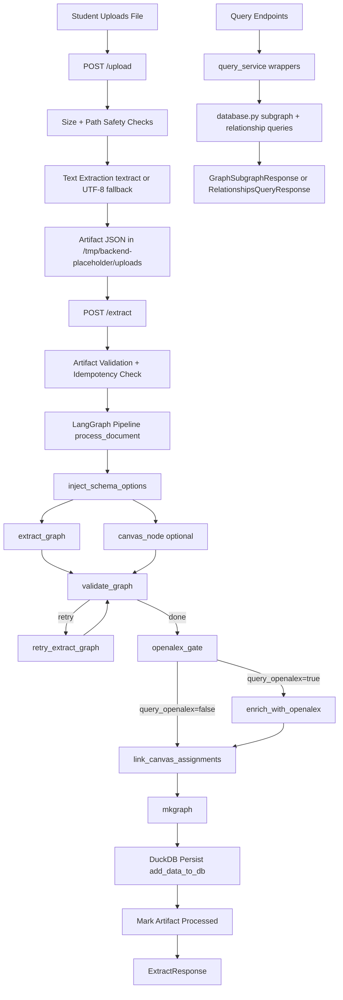

# BackendPlaceholder API

BackendPlaceholder is a FastAPI backend that turns uploaded learning materials into a queryable knowledge graph. It is built for student-facing workflows: upload course content, run AI extraction, and query relationships/subgraphs for study assistance.

This README is intentionally API-first and hackathon-ready.

## Why This Project Fits the Hackathon

- Student scenario: convert class documents into structured knowledge for studying.
- Meaningful AI: LLM extraction + optional enrichment (OpenAlex/Canvas) directly powers graph creation.
- Demo-ready: clean upload -> extract -> query flow with deterministic API contracts.
- Suggested guiding category: **Studying**.

## Demo Story (5 Minutes)

1. Upload one class document (`POST /upload`).
2. Extract graph (`POST /extract`) and show added entity/relationship counts.
3. Query confidence-filtered relationships (`GET /query/relationships`).
4. Query a subgraph by source or entity (`/query/subgraph/...`) and show how it supports review.
5. Close with responsible AI notes (limits, validation, error paths).

## Team Roles (Suggested Ownership)

- Tech Lead: API reliability, data flow, and demo infrastructure.
- Product Lead: problem framing, user story, and demo script.
- Ethics Lead: risk review, mitigation messaging, and responsible use guardrails.

## Architecture At a Glance



## Tech Stack

- Python 3.13+
- FastAPI + Pydantic
- LangGraph
- DuckDB
- Nix (dev/build)

## Run Locally

### 1) Enter the dev shell

```bash
nix develop
```

### 2) Set environment variables

```bash
export OPENAI_API_KEY="your-openai-key"
export OPENALEX_API_KEY="your-openalex-key"   # optional
export CANVAS_API_KEY="your-canvas-key"       # optional
```

### 3) Start the API

```bash
nix run .#deploy-backend
```

Server default: `http://localhost:8000`

## Core API Conventions

- Base URL: `http://localhost:8000`
- Content-Type: `application/json` for JSON endpoints
- Upload endpoint uses `multipart/form-data`
- Service-layer errors are normalized to:

```json
{
  "detail": {
    "error_code": "string",
    "message": "human-readable message"
  }
}
```

- Validation errors from Pydantic are wrapped as HTTP 422 with `error_code: "validation_error"`.

## Endpoint Index

| Method | Path | Purpose |
|---|---|---|
| GET | `/health` | Liveness check |
| POST | `/upload` | Ingest file, extract text, create artifact |
| POST | `/extract` | Run KG extraction pipeline from artifact |
| GET | `/query/relationships` | List relationships with confidence filters |
| GET | `/query/subgraph/source/{source_id}` | Subgraph by one source |
| POST | `/query/subgraph/sources` | Subgraph by many sources |
| GET | `/query/subgraph/entity/{entity_id_or_name}` | Subgraph by entity ID or name |
| GET | `/query/relationships/type/{relationship_type}` | Subgraph by relationship type |
| POST | `/query/subgraph/entity-types` | Subgraph by entity type list |

---

## Detailed API Reference

### GET `/health`

Simple readiness endpoint.

Response 200:

```json
{
  "health": "ok"
}
```

---

### POST `/upload`

Uploads a file, enforces size limits, extracts text, and writes an artifact JSON used later by `/extract`.

Request:
- `multipart/form-data`
- field: `file` (`UploadFile`)

Size constraints:
- compressed upload <= `20 MiB`
- decompressed payload <= `100 MiB`

Success 200 (`UploadResponse`):

```json
{
  "source_id": "string",
  "source_name": "lecture-2.pdf",
  "artifact_path": "/tmp/backend-placeholder/uploads/artifact-<id>.json",
  "artifact_sha256": "hex_sha256",
  "metadata_status": "ok",
  "metadata_error_code": null,
  "metadata_error_message": null,
  "compressed_bytes": 12345,
  "decompressed_bytes": 67890
}
```

Common service errors:
- `413 compressed_size_exceeded`
- `413 decompressed_size_exceeded`
- `422 empty_extracted_text`

Note on `metadata_status`:
- textract issues do not always fail the request; metadata fields capture extraction warning/error state.

---

### POST `/extract`

Runs extraction pipeline from an artifact created by `/upload`, persists the graph to DuckDB, and returns counts.

Request body (`ExtractRequest`):

```json
{
  "artifact_path": "/tmp/backend-placeholder/uploads/artifact-<id>.json",
  "query_canvas": false,
  "query_openalex": false
}
```

Response 200 (`ExtractResponse`):

```json
{
  "artifact_path": "/tmp/backend-placeholder/uploads/artifact-<id>.json",
  "artifact_sha256": "hex_sha256",
  "already_processed": false,
  "added_entities": 42,
  "added_relationships": 88,
  "sources": [
    {
      "source_id": "string",
      "source_name": "lecture-2.pdf"
    }
  ]
}
```

Idempotency behavior:
- if the same `(artifact_path, artifact_sha256)` was processed before, returns `already_processed: true` and `added_*: 0`.

Common service errors:
- `400 artifact_path_not_allowed`
- `400 artifact_path_invalid_suffix`
- `404 artifact_not_found`
- `400 artifact_invalid`

---

### GET `/query/relationships`

Returns relationship records with optional confidence bounds.

Query params:
- `limit` (int, default `100`, max `1000`)
- `offset` (int, default `0`, min `0`)
- `min_confidence` (float 0..1, optional)
- `max_confidence` (float 0..1, optional)

Validation rule:
- if both are set, `min_confidence <= max_confidence`

Response 200 (`RelationshipsQueryResponse`):

```json
{
  "items": [
    {
      "subject_entity_id": "ent_a",
      "object_entity_id": "ent_b",
      "relationship_type": "string",
      "confidence": 0.93,
      "data": {}
    }
  ],
  "total": 1,
  "limit": 100,
  "offset": 0
}
```

Validation failure:
- `422 validation_error`

---

### GET `/query/subgraph/source/{source_id}`

Returns a subgraph filtered by one source.

Path param:
- `source_id` (string)

Query params:
- `limit` (1..1000, default 100)
- `offset` (>=0, default 0)

Response 200 (`GraphSubgraphResponse`):

```json
{
  "entities": [],
  "relationships": [],
  "sources": [],
  "total_entities": 0,
  "total_relationships": 0,
  "total_sources": 0,
  "limit": 100,
  "offset": 0
}
```

Validation failure:
- `422 validation_error`

---

### POST `/query/subgraph/sources`

Returns a subgraph filtered by multiple source IDs.

Request body (`SourcesSubgraphRequest`):

```json
{
  "source_ids": ["source_1", "source_2"]
}
```

Constraints:
- list length: `1..100`
- blank IDs are stripped; all-empty payload is rejected

Response:
- `GraphSubgraphResponse` (same structure as above)

Validation failure:
- `422 validation_error`

---

### GET `/query/subgraph/entity/{entity_id_or_name}`

Returns a subgraph around a matching entity.

Path param:
- `entity_id_or_name` (string; lookup by exact ID first, then case-insensitive name)

Query params:
- `limit` (1..1000, default 100)
- `offset` (>=0, default 0)

Response:
- `GraphSubgraphResponse`

Validation failure:
- `422 validation_error`

---

### GET `/query/relationships/type/{relationship_type}`

Returns a subgraph filtered by relationship type.

Path param:
- `relationship_type` (must be valid ontology value)

Query params:
- `limit` (1..1000, default 100)
- `offset` (>=0, default 0)

Response:
- `GraphSubgraphResponse`

Validation failure:
- `422 validation_error`

---

### POST `/query/subgraph/entity-types`

Returns a subgraph where both relationship endpoints are within selected entity types.

Request body (`EntityTypesSubgraphRequest`):

```json
{
  "entity_types": ["Concept", "Method"]
}
```

Allowed values:
- `Concept`, `Theory`, `Person`, `Method`, `Assignment`

Constraints:
- list length: `1..20`
- invalid values rejected by validation

Response:
- `GraphSubgraphResponse`

Validation failure:
- `422 validation_error`

---

## Data Model Notes (For Integrators)

- DuckDB file location: `/tmp/knowledge.duckdb`
- Upload/artifact root: `/tmp/backend-placeholder/uploads`
- Artifact processing log table: `PROCESSED_ARTIFACTS`
- Core graph tables: `ENTITIES`, `RELATIONSHIPS`, `SOURCES`
- Confidence sorting in relationship queries: descending (`NULLS LAST`)

## Responsible AI + Risk Mitigations

- Input safety: artifact path sandboxing + required `.json` suffix to block arbitrary filesystem reads.
- Resource protection: compressed/decompressed upload limits.
- Robust extraction: timeout-guarded textract adapter with structured metadata errors.
- Validation discipline: strong Pydantic constraints and 422 normalization.
- Idempotency: repeated extract calls do not duplicate processing.

## What Judges Can Verify Quickly

- **Technical Impressiveness (50%)**: full upload->extract->query pipeline with persistence and typed contracts.
- **Impact (20%)**: directly helps students turn raw notes/docs into structured study context.
- **Product Thinking (10%)**: clear problem -> API capability -> demo narrative.
- **Use of AI to Build (10%)**: AI is central in extraction/enrichment and can be explained live.
- **Ethics / Responsible Use (10%)**: explicit constraints, safe path handling, and error transparency.

## Useful Commands

```bash
# Run backend
nix run .#deploy-backend

# Lint
flake8 lib/

# Build Docker image
nix build .#docker
```

## Project Structure

```text
lib/backend_placeholder/
  api.py                    # FastAPI routes + HTTP error translation
  models.py                 # Pydantic request/response contracts
  agent.py                  # LangGraph pipeline assembly + process_document
  database.py               # DuckDB schema, writes, and query functions
  services/
    upload_service.py       # Upload ingestion + artifact creation
    extract_service.py      # Artifact-to-graph extraction + persistence
    query_service.py        # API-facing query wrappers
    path_safety.py          # Upload root sandbox + path validation
    textract_adapter.py     # Timeout-guarded text extraction adapter
```

## Current Scope Limitations

- Automated test suite is not configured in this repository yet.
- API auth/rate limiting is not implemented (hackathon prototype scope).
- Upload flow currently assumes extraction-compatible documents and local tmp storage.
